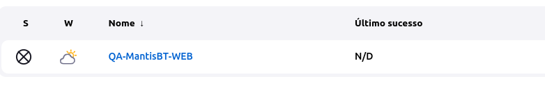
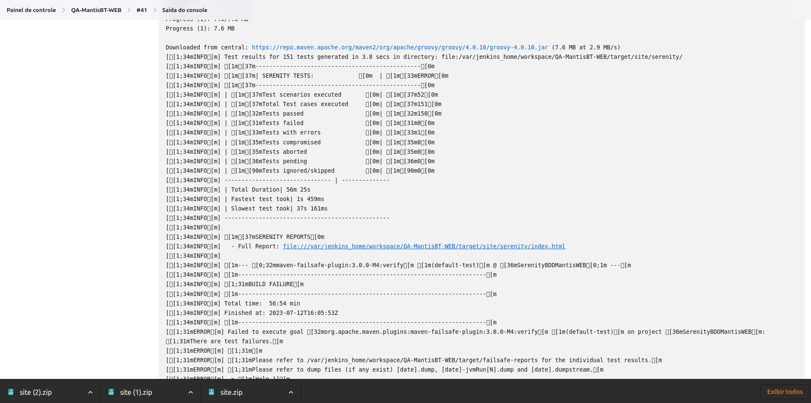
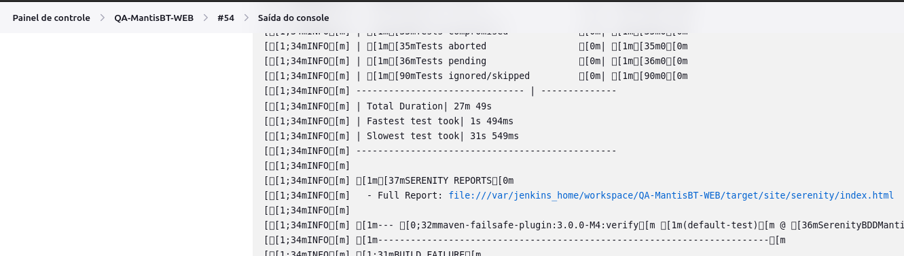
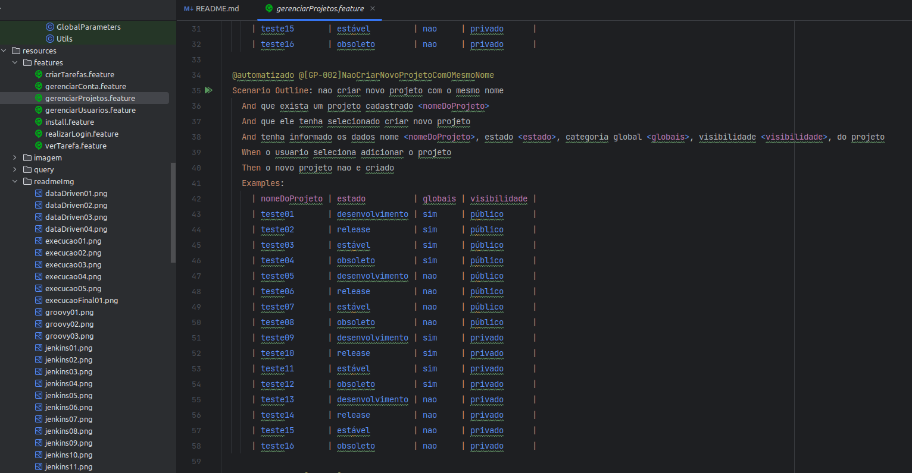
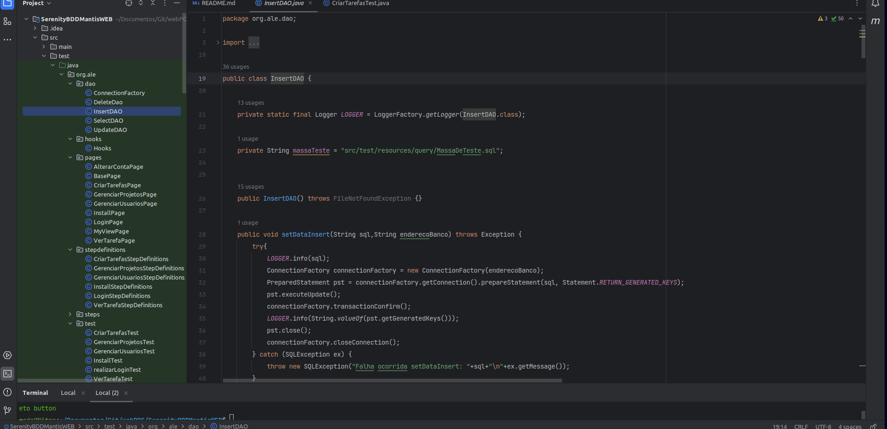

# Framework de Teste WEB com SerenityBDD, cucumber com Ambiente CI/CD com Jenkins e Selenium Grid 4 para Testes automatizados

Neste tutorial, vamos explorar como configurar um ambiente Jenkins CI/CD, utilizando o Docker para montar um ambiente com os contêineres do MantisBT, MySQL e Jenkins, juntamente com o uso do framework de teste de API RestAssured. O ambiente de testes Docker fornecerá uma infraestrutura completa e escalável para executar testes de API do MantisBT API de forma automatizada e controlada.
Ao Final deste tutorial teremos implementado um Pipepline com CI/CD completo de testes automatizados.

## Ambiente de Testes Docker

O ambiente de testes Docker contém os seguintes contêineres:

- **MantisBT 2.22.1**: um sistema de gerenciamento de problemas e rastreamento de defeitos, usado para acompanhar e resolver problemas em um projeto de software.
- **MySQL 5.7**: um sistema de gerenciamento de banco de dados relacional, utilizado para armazenar e recuperar dados necessários para os testes.
- **Jenkins 2.401.1**: uma plataforma de automação de CI/CD (Integração Contínua/Entrega Contínua), que permite criar e executar pipelines de testes automatizados.
- **Selenium Grid 4**: O Selenium Grid 4 é uma ferramenta de automação de testes que permite a execução simultânea de testes em diferentes navegadores e sistemas operacionais. Ele distribui os testes entre vários nós de execução para acelerar o processo de testes.

A combinação do Serenity BDD com o ambiente de testes Jenkins junto ao Selenium Grid 4 no Docker nos permite realizar testes completos de ponta a ponta em automações.

Vamos começar a aproveitar os benefícios deste ambiente de teste poderoso para automatizar e validar seus testes automatizados!


# Framework SerenityBDD, Cucumber, Selenium e Java de Teste WEB 

Este é um projeto de framework de teste de WEB altamente eficiente, desenvolvido para simplificar e agilizar o processo de codificação de testes automatizados web. Com base nas bibliotecas mais poderosas e populares do ecossistema Java para testes automatizados web, este framework oferece uma estrutura robusta e flexível para a automação de testes de web.

## Recursos Destacados

- **Java 8**: Linguagem de programação versátil, orientada a objetos e altamente portátil, com um vasto ecossistema de bibliotecas e ferramentas. É amplamente utilizado para o desenvolvimento de aplicativos empresariais, web e móveis devido à sua segurança, desempenho e facilidade de uso.
 ####
- **Cucumber**: Aproveite o poder do BDD (Behavior-Driven Development) com o Cucumber, uma biblioteca que permite escrever testes em uma linguagem de domínio específica (Gherkin) e executá-los em um formato legível para não desenvolvedores. Isso facilita a colaboração entre equipes técnicas e não técnicas.
 ####
- **Selenium 4**: O Selenium 4 é uma atualização do popular framework de automação de testes que oferece suporte a recursos aprimorados, como suporte nativo para o W3C WebDriver, suporte para automação de aplicações WEB mais intuitiva e simplificada.
 ####
- **Serenity BDD**: O SerenityBDD é um framework de automação de testes que oferece relatórios detalhados e legíveis e integração com BDD, permitindo uma abordagem orientada a comportamento nos testes automatizados.
 ####
- **JUnit 4**: Aproveite os recursos do JUnit 4, um framework de teste unitário amplamente utilizado para Java. Ele permite que você defina casos de teste individuais, organize-os em suítes de testes e execute-os com eficiência. O JUnit 4 também oferece recursos avançados, como anotações de configuração e assertivas poderosas.
 ####
- **MySQL**: Aproveite a integração com o MySQL para armazenar e gerenciar dados em seus testes. O MySQL é um sistema de gerenciamento de banco de dados relacional amplamente utilizado, conhecido por sua confiabilidade e desempenho. Com o MySQL, você pode criar tabelas, inserir dados, realizar consultas e muito mais, tornando-o uma escolha poderosa para o armazenamento e recuperação de dados em seus testes.

## Arquitetura Page Object
   - **Padrão Page Object (PO)**: Um modelo de design para automação de testes que separa a lógica de interação com a página (Page) dos passos de teste (Step), mapeados pelos passos de definição (StepDefinitions), para facilitar a manutenção e reutilização de código.
   - <details>
      <summary>Implementação do padrão Page Object</summary>

     
   </details>

   - **Page**: Representa uma página ou componente da interface do usuário, encapsulando a lógica de interação com os elementos da página em métodos, promovendo a reutilização e a modularidade.
   - <details>
      <summary>Implementação do Page</summary>

      
   </details>

   - **Step**: Define ações e verificações em um cenário de teste, usando os métodos da classe Page para interagir com a interface do usuário, facilitando a legibilidade e a manutenção dos testes.
   - <details>
      <summary>Implementação do Step</summary>

      
   </details>

   - **StepDefinitions**: Mapeia os passos definidos em linguagem natural (Gherkin) para os métodos do Step, estabelecendo a conexão entre a especificação de teste e a implementação dos passos.
   - <details>
      <summary>Implementação do StepDefinitons</summary>

      
   </details>

   - **Test**: É a execução dos cenários de teste usando os passos de definição e os page objects, garantindo a automação dos fluxos de teste e a verificação dos resultados esperados.
   - <details>
      <summary>Implementação do Test</summary>

     
   </details>

## Configuração e Execução
    
### Pré-requisitos
### Hardware:
- Processador: Intel Core i7-7700HQ ou AMD Ryzen 5600G
- Memória RAM: 16 GB
- Armazenamento: 20GB de espaço livre
- Conectividade: Acesso à Internet estável

### Software:

#### S.O Ubuntu 22.04 : 
<details>
  <summary>Como instalar o Ubuntu 22.04</summary>

## Passo a passo para instalar o Ubuntu 22.04:

1. Faça o download da imagem ISO do Ubuntu 22.04 no [site oficial do Ubuntu](https://releases.ubuntu.com/22.04/).

2. Grave a imagem ISO em um disco ou crie um pendrive inicializável. Você pode usar ferramentas como o [Etcher](https://etcher.io/) ou o [Rufus](https://rufus.ie/) para criar um pendrive inicializável.

3. Insira o disco ou o pendrive inicializável no computador onde deseja instalar o Ubuntu 22.04.

4. Reinicie o computador e acesse a configuração de inicialização (geralmente pressionando "F2" ou "Del" durante a inicialização, mas pode variar dependendo do fabricante do seu computador).

5. Na configuração de inicialização, defina a opção de inicialização para o disco ou o pendrive inicializável.

6. Salve as configurações e saia da configuração de inicialização. O computador reiniciará e será inicializado a partir do disco ou do pendrive.

7. Siga as instruções na tela para instalar o Ubuntu 22.04. Você poderá escolher o idioma, definir as configurações regionais e particionar o disco, se necessário.

8. Durante a instalação, você também precisará fornecer informações como nome de usuário, senha e outros detalhes específicos.

9. Após a conclusão da instalação, reinicie o computador e inicialize no Ubuntu 22.04 a partir do disco rígido.

10. Parabéns! Agora você tem o Ubuntu 22.04 instalado no seu computador. Você pode começar a explorar e usar o sistema operacional.

</details>

#### OpenJDK 1.8 :
<details>
  <summary>Como instalar o OpenJDK 1.8 e configurar as variáveis de ambiente</summary>

## Passo a passo para instalar o OpenJDK 1.8 e configurar as variáveis de ambiente:

1. Abra o terminal pressionando "Ctrl + Alt + T" no teclado.

2. Execute o seguinte comando para instalar o OpenJDK 1.8:

   ```
   sudo apt update
   sudo apt install openjdk-8-jdk
   ```

3. Após a instalação, verifique se o Java foi instalado corretamente executando o seguinte comando:

   ```
   java -version
   ```

   Isso exibirá a versão do Java instalada no seu sistema. Deve mostrar algo semelhante a:

    ```
    openjdk version "1.8.x_xxx"
    OpenJDK Runtime Environment (build 1.8.x_xxx-ubuntu0.xx.xx.xx)
    OpenJDK 64-Bit Server VM (build 25.x_xxx-ubuntu0.xx.xx.xx, mixed mode)
    ```

4. Agora, vamos configurar as variáveis de ambiente para o OpenJDK 1.8. Abra o arquivo `/etc/environment` com um editor de texto usando o seguinte comando:

   ```
   sudo nano /etc/environment
   ```

5. Adicione a seguinte linha ao arquivo, substituindo `/usr/lib/jvm/java-8-openjdk-amd64` pelo caminho correto da instalação do OpenJDK 1.8 em seu sistema:

   ```
   JAVA_HOME=/usr/lib/jvm/java-8-openjdk-amd64
   ```

6. Pressione "Ctrl + X" para sair do editor de texto, pressione "Y" para confirmar as alterações e pressione Enter para salvar o arquivo com o mesmo nome.

7. Execute o seguinte comando para recarregar as variáveis de ambiente:

   ```
   source /etc/environment
   ```

8. Agora, vamos adicionar o diretório do Java ao PATH do sistema. Abra o arquivo `~/.bashrc` com um editor de texto usando o seguinte comando:

   ```
   nano ~/.bashrc
   ```

9. Adicione a seguinte linha ao final do arquivo:

   ```
   export PATH="$PATH:$JAVA_HOME/bin"
   ```

10. Pressione "Ctrl + X" para sair do editor de texto, pressione "Y" para confirmar as alterações e pressione Enter para salvar o arquivo com o mesmo nome.

11. Execute o seguinte comando para recarregar o arquivo `~/.bashrc`:

    ```
    source ~/.bashrc
    ```

12. Agora você tem o OpenJDK 1.8 instalado e as variáveis de ambiente configuradas corretamente. Você pode começar a usar o Java 8 em seu sistema.

</details>


#### Docker 20.10.24
<details>
  <summary>Como instalar o Docker no Ubuntu 22.04</summary>

## Passo a passo para instalar o Docker no Ubuntu 22.04:

1. Abra o terminal pressionando "Ctrl + Alt + T" no teclado.

2. Remova versões antigas do Docker, se existirem, executando o seguinte comando:

   ```
   sudo apt remove docker docker-engine docker.io containerd runc
   ```

3. Atualize a lista de pacotes com o seguinte comando:

   ```
   sudo apt update
   ```

4. Instale os pacotes necessários para permitir que o apt utilize repositórios via HTTPS, executando o seguinte comando:

   ```
   sudo apt install apt-transport-https ca-certificates curl gnupg-agent software-properties-common
   ```

5. Adicione a chave GPG oficial do Docker executando o seguinte comando:

   ```
   curl -fsSL https://download.docker.com/linux/ubuntu/gpg | sudo gpg --dearmor -o /usr/share/keyrings/docker-archive-keyring.gpg
   ```

6. Adicione o repositório do Docker às fontes do APT, executando o seguinte comando:

   ```
   echo "deb [arch=amd64 signed-by=/usr/share/keyrings/docker-archive-keyring.gpg] https://download.docker.com/linux/ubuntu $(lsb_release -cs) stable" | sudo tee /etc/apt/sources.list.d/docker.list > /dev/null
   ```

7. Atualize a lista de pacotes novamente, agora incluindo o repositório do Docker, com o seguinte comando:

   ```
   sudo apt update
   ```

8. Agora, você pode instalar o Docker executando o seguinte comando:

   ```
   sudo apt install docker-ce docker-ce-cli containerd.io
   ```

9. Após a conclusão da instalação, verifique se o Docker foi instalado corretamente executando o comando:

   ```
   docker --version
   ```

   Isso exibirá a versão do Docker instalada no seu sistema.

10. Parabéns! Agora você tem o Docker instalado no Ubuntu 22.04. Você pode começar a usar o Docker para criar e gerenciar contêineres.

</details>

#### Intellij Idea Community version 2023.1.2
<details>
  <summary>Como instalar o IntelliJ IDEA Community</summary>

## Passo a passo para instalar o IntelliJ IDEA Community:

1. Abra o terminal pressionando "Ctrl + Alt + T" no teclado.

2. Faça o download do arquivo de instalação do IntelliJ IDEA Community Edition no [site oficial da JetBrains](https://www.jetbrains.com/idea/download).

3. Navegue até o local onde o arquivo de instalação foi baixado.

4. Extraia o arquivo de instalação usando o seguinte comando:

   ```
   tar -xzf nome_do_arquivo.tar.gz
   ```

5. Acesse o diretório extraído usando o seguinte comando:

   ```
   cd nome_do_diretorio
   ```

6. Execute o script de instalação usando o seguinte comando:

   ```
   ./bin/idea.sh
   ```

7. O IntelliJ IDEA Community será iniciado e você será guiado pelo assistente de configuração inicial.

8. Siga as instruções na tela para configurar suas preferências, como temas, plugins, esquemas de teclado, etc.

9. Após a configuração inicial, o IntelliJ IDEA Community Edition estará pronto para uso.

10. Parabéns! Agora você tem o IntelliJ IDEA Community Edition instalado no seu sistema. Você pode começar a desenvolver aplicativos usando o IntelliJ IDEA.

</details>

#### Firefox ou qualquer navegador de sua preferencia

#### Instalação do Firefox no Ubuntu 22.04
 <details>
        <summary>Clique aqui para ver o passo a passo de instalação</summary>

- #### Passo 1: Abrir o Terminal

    #### Abra o terminal no Ubuntu. Você pode fazer isso pressionando `Ctrl + Alt + T` no teclado ou pesquisando por "Terminal" no menu de aplicativos.

- #### Passo 2: Verificar a disponibilidade do Snap

    #### O Ubuntu 22.04 inclui o Snap por padrão. Para verificar se o Snap está instalado, execute o seguinte comando no terminal:
    ```bash
    snap version
    ```
    #### Se o Snap estiver instalado, você verá a versão do Snap instalada no seu sistema. Caso contrário, você pode instalar o Snap executando o seguinte comando :
    ```bash
    sudo apt update
    sudo apt install snapd
    ```
- #### Passo 3: Instalar o Firefox via Snap
  
    #### Para instalar o Firefox usando o Snap, execute o seguinte comando no terminal:
    ```bash
    sudo snap install firefox
    ```
    #### Digite Y ou S quando solicitado para confirmar a instalação. O sistema irá baixar e instalar o Firefox via Snap.  

- #### Passo 4: Verificar a Instalação

  #### Após a instalação, você pode verificar se o Firefox foi instalado corretamente executando o seguinte comando no terminal:    
  ```bash
    sudo snap install firefox
    ```
    
</details>

#### Portas de rede : 80, 8989, 3606, 8080, 8081, 50000, 7900

#### Usuario root no Ubuntu

## Configuração do ambiente de teste
Neste passo iremos configurar a estrutura de pastas do nosso ambiente, junto a isso iremos subir o nosso ambiente de teste.

Para começar a utilizar este framework de teste de API, siga estas etapas:
- ### Configurando a estrutura de arquivos e clonando o repositorio Git 
  1. Abra o terminal pressionando "Ctrl + Alt + T" no teclado.

     - #### crie uma pasta com o nome git em Documentos
        ```bash
        mkdir ~/Documentos/git/
        ```
     - #### crie uma pasta com o nome docker em Documentos
        ```bash
        mkdir ~/Documentos/docker/
        ``` 
     - #### Navegue até o diretório, no terminal
        ```bash
        cd ~/Documentos/git/
        ```
     - #### No terminal realize o clone do repositorio 
        ```bash
        git clone https://github.com/AlessandroLimaSilva/SerenityBDDMantisWEB.git
       ```
     - #### No terminal acesse a pasta
        ```bash
        cd ~/Documentos/git/SerenityBDDMantisWEB
        ```
     - #### Copie os arquivo docker-compose.yml, jenkinsFile, plugins.txt para a pasta Documentos/docker  
        ```bash
        cp ~/Documentos/git/SerenityBDDMantisWEB/docker-compose.yml ~/Documentos/docker/
        ```
     - #### Copie os arquivo docker-compose.yml, jenkinsFile, plugins.txt para a pasta Documentos/docker
        ```bash 
        cp ~/Documentos/git/SerenityBDDMantisWEB/jenkinsFile ~/Documentos/docker/
        ```
     - #### Copie os arquivo docker-compose.yml, jenkinsFile, plugins.txt para a pasta Documentos/docker
        ```bash
        cp ~/Documentos/git/SerenityBDDMantisWEB/plugins.txt ~/Documentos/docker/
        ```
- ### Iniciando o ambiente de teste  
  #### Agora que ja temos nossa estrutura de arquivos esta configurada podemos subir o ambiente
  1. Abra o terminal pressionando "Ctrl + Alt + T" no teclado.

      - #### Acesse a pasta Documentos/docker
         ```bash
         cd ~/Documentos/git/
         ```
     - #### Vamos criar uma rede para o nosso container
        ```bash
        sudo docker network create grid
        ``` 
       
      - #### Iniciando o Docker
         ```bash
         sudo docker-compose -f docker-compose.yml up -d
         ```
      - #### Aguarde o docker realizar o download dos container e suas dependencias, ao finalizar voce ira ver no terminal.
         ```bash
         [+] Running 8/8
         ✔ Network docker_default       Created                                    0.1s
         ✔ Container docker-mysql-1     Started                                    0.7s
         ✔ Container docker-mantisbt-1  Started                                    1.0s
         ✔ Container jenkins            Started                                    1.4s
         ✔ Container selenium-hub       Started                                    1.8s
         ✔ Container docker-firefox-1   Started                                    2.3s
         ✔ Container docker-chrome-1    Started                                    2.3s
         ✔ Container docker-edge-1      Started                                    2.3s

         ```
        
      - #### conferindo se o ambiente de teste foi iniciado corretamente
         ```bash
        code@Nitro:~/Documentos/docker$ sudo docker ps -a
        CONTAINER ID   IMAGE                                   COMMAND                  CREATED          STATUS          PORTS                                                                                      NAMES
        6788659d79e8   selenium/node-chrome:4.10.0-20230607    "/opt/bin/entry_poin…"   11 minutes ago   Up 11 minutes   5900/tcp                                                                                   docker-chrome-1 
        99be26385a29   selenium/node-firefox:4.10.0-20230607   "/opt/bin/entry_poin…"   11 minutes ago   Up 11 minutes   5900/tcp                                                                                   docker-firefox-1
        ad492334f310   selenium/node-edge:4.10.0-20230607      "/opt/bin/entry_poin…"   11 minutes ago   Up 11 minutes   5900/tcp                                                                                   docker-edge-1
        817bf4cb9f05   selenium/hub:4.10.0-20230607            "/opt/bin/entry_poin…"   11 minutes ago   Up 11 minutes   0.0.0.0:4442-4444->4442-4444/tcp, :::4442-4444->4442-4444/tcp                              selenium-hub
        970cb02f704d   docker-jenkins                          "/usr/bin/tini -- /u…"   11 minutes ago   Up 11 minutes   0.0.0.0:50000->50000/tcp, :::50000->50000/tcp, 0.0.0.0:8081->8080/tcp, :::8081->8080/tcp   jenkins
        e567daf99a79   vimagick/mantisbt:latest                "docker-php-entrypoi…"   11 minutes ago   Up 11 minutes   0.0.0.0:8989->80/tcp, :::8989->80/tcp                                                      docker-mantisbt-1
        d4dcb849bc9a   mysql:5.7                               "docker-entrypoint.s…"   11 minutes ago   Up 11 minutes   0.0.0.0:3306->3306/tcp, :::3306->3306/tcp, 33060/tcp                                       docker-mysql-1
        ```
      - #### Ao final desse passo nosso ambiente ja esta online.

- ### Configurando as aplicações
    Agora que terminamos de configurar nossa estrutura de arquivos podemos configurar as aplicações em nosso ambiente de teste.
- ### Configurando o MantisBT
  #### 1. Abra um navegador e digite na barra de endereço
  #### [http://0.0.0.0:8989/admin/install.php](http://0.0.0.0:8989/admin/install.php)

  #### ou

  #### [http://localhost:8989/admin/install.php](http://localhost:8989/admin/install.php)

  #### 2. Configurando o banco de dados do MantisBT
  A tela de configuração da aplicação MantisBT sera apresentada  
  
  - Preencha os seguintes campos
  - #### Em type of database Selecione
    ```bash
    MySQL Improved
    ```
  - #### Em Hostname (for Database Server) informe
    ```bash
    mysql
    ```
  - #### Em Username (for Database) informe
    ```bash
    root
    ``` 
  - #### Em Password (for Database) informe
    ```bash
    root
    ```
  - #### Em Database name (for Database) informe
    ```bash
    bugtracker
    ``` 
  - #### Em Admin Username (to create Database if required) informe
    ```bash
    root
    ```
  - #### Em Admin Password (to create Database if required) informe
    ```bash
    root
    ```     
  - #### Em Default Time Zone selecione
    ```bash
    Sao Paulo
    ```   
  - #### Realize um click em Install/Upgrade Database
    
  
  - #### A seguinte tela sera apresentada
    
  - #### Agora clique em Back to administration
    A tela de configuração da aplicação MantisBT sera apresentada
    
  
  

  - ### 3. Configurando o Jenkins
      #### 1. Abra o terminal pressionando "Ctrl + Alt + T" no teclado e digite.
      ```bash
      sudo docker ps -a
      ```
      #### Sera retornado as informações dos container
      ```bash
        code@Nitro:~$ sudo docker ps -a
        CONTAINER ID   IMAGE                                   COMMAND                  CREATED             STATUS             PORTS                                                                                      NAMES
        6788659d79e8   selenium/node-chrome:4.10.0-20230607    "/opt/bin/entry_poin…"   About an hour ago   Up About an hour   5900/tcp                                                                                   docker-chrome-1
        99be26385a29   selenium/node-firefox:4.10.0-20230607   "/opt/bin/entry_poin…"   About an hour ago   Up About an hour   5900/tcp                                                                                   docker-firefox-1
        ad492334f310   selenium/node-edge:4.10.0-20230607      "/opt/bin/entry_poin…"   About an hour ago   Up About an hour   5900/tcp                                                                                   docker-edge-1
        817bf4cb9f05   selenium/hub:4.10.0-20230607            "/opt/bin/entry_poin…"   About an hour ago   Up About an hour   0.0.0.0:4442-4444->4442-4444/tcp, :::4442-4444->4442-4444/tcp                              selenium-hub
        970cb02f704d   docker-jenkins                          "/usr/bin/tini -- /u…"   About an hour ago   Up About an hour   0.0.0.0:50000->50000/tcp, :::50000->50000/tcp, 0.0.0.0:8081->8080/tcp, :::8081->8080/tcp   jenkins
        e567daf99a79   vimagick/mantisbt:latest                "docker-php-entrypoi…"   About an hour ago   Up About an hour   0.0.0.0:8989->80/tcp, :::8989->80/tcp                                                      docker-mantisbt-1
        d4dcb849bc9a   mysql:5.7                               "docker-entrypoint.s…"   About an hour ago   Up About an hour   0.0.0.0:3306->3306/tcp, :::3306->3306/tcp, 33060/tcp                                       docker-mysql-1
      ```    
      #### Iremos copiar o CONTAINER ID do nosso container do Jenkins e no terminal e iremos digitar.
      #### sudo docker exec -it CONTAINER ID bash
      ```bash
      sudo docker exec -it 970cb02f704d bash 
      ```
      #### Agora estamos acessando o container do jenkins pelo terminal, com isso iremos copiar o password para acessar o jenkins no terminal e digitamos.
      ```bash
      cat /var/jenkins_home/secrets/initialAdminPassword 
      ```
      
      #### Copie o password, precisaremos dele para acessar o jenkins

      #### 2. Abra um navegador e digite na barra de endereço
      #### [http://0.0.0.0:8081/login?from=%2F](http://0.0.0.0:8081/login?from=%2F)

      #### ou

      #### [http://localhost:8081/login?from=%2F](http://localhost:8081/login?from=%2F)
      #### Vamos informar a senha de administrador que copiamos no terminal [76ffc585c41b4dcaa0844b2ebc896e85](76ffc585c41b4dcaa0844b2ebc896e85)
      
    
      #### Clique em Instalar as extensões sugeridas, as extensões necessarias ja foram adicionadas no container.
      
      
      #### Agora iremos preencher os campos para criar um usuario administrativo
      - #### Em Nome de usuario informe
      ```bash
      root
      ```
      - #### Em Senha informe
      ```bash
      root
      ```
      - #### Em Confirmar Senha informe
      ```bash
      root
      ```
      - #### Em Nome Completo informe
      ```bash
      root root
      ```
      - #### Em Endereço de Email informe
      ```bash
      root@root.com
      ```
      - #### Clique em Salvar e continuar
      
      - #### Clique em Gravar e Concluir
      
      - #### Clique em Reiniciar
      
      - #### Aguarde o jenkins realizar as configurações, se dentro de 5 minutos a pagina não recarregar sozinha aperte F5 para recarregar a pagina.
      

    #### 3. Agora iremos configurar o job no jenkins para executar os nossos testes de modo continuo CI com o nosso codigo que esta no github.
    #### Agora iremos preencher os campos para realizar o login
      - #### Em Nome de usuario informe
      ```bash
      root
      ```
      - #### Em Senha informe
      ```bash
      root
      ```
      #### Agora clique em entrar
      
    
    #### Clique em nova tarefa
    
    
    #### Informe o nome do teste 
    ```bash
    QA-MantisBT-WEB
    ```
    
    
    #### Clique em Construir um projeto de software de estilo livre
    

    #### Clique em Tudo certo
    
    
    #### Informe a descrição do projeto 
    ```bash
    Testes automatizados WEB MantisBT
    ```
    
    
    #### Selecione Esta construção é parametrizada. 
    

    #### Clique em Adicionar parametro
    

    #### Clique em Parametro de texto
    

    #### Preencha Nome 
    ```bash
    NAVEGADOR
    ```
    
  
    #### Agora iremos preencher valor com o navegador em que queremos executar nossos teste neste caso chrome
    #### Temos configurado no projeto 3 navegadores chrome, firefox e edge.
    #### Para executar qualquer um dos 3 e so mudar o valor passado neste campo.
    ```bash
    chrome
    ```
    

    #### Clique em novamente Adicionar parametro
    

    #### Clique em Parametro de texto
    

    #### Preencha Nome
    ```bash
    AMBIENTE
    ```
    

    #### Preencha Nome
    ```bash
    hml
    ```
    

    - ### Configurando as url das nossas aplicações
    
    Dado o workaround " \^^/ Bug para os mais intimos " realizado pelo pessoal do SeleniumGrid.
    ####
    Mesmo criando uma rede, o SeleniumGrid cria outra rede em outra faixa de ips por isso precisamos pegar o ip das nossas aplicações. 
    ####
    Todas as vezes em que for realizado um down no container sera necessario pegar os ips novamente.    
    ####
    Esta é uma opção de adicionar as urls de um modo mais rapido so para fins de teste do projeto !
    ####
    O correto é adicionar no arquivo globalParameters.propeties e realizar um push no git do projeto.

      - #### No terminal digite  :
     ```bash
        code@Nitro:~/Documentos/docker$ sudo docker ps -a
        CONTAINER ID   IMAGE                                   COMMAND                  CREATED             STATUS             PORTS                                                                                      NAMES
        6788659d79e8   selenium/node-chrome:4.10.0-20230607    "/opt/bin/entry_poin…"   About an hour ago   Up About an hour   5900/tcp                                                                                   docker-chrome-1
        99be26385a29   selenium/node-firefox:4.10.0-20230607   "/opt/bin/entry_poin…"   About an hour ago   Up About an hour   5900/tcp                                                                                   docker-firefox-1
        ad492334f310   selenium/node-edge:4.10.0-20230607      "/opt/bin/entry_poin…"   About an hour ago   Up About an hour   5900/tcp                                                                                   docker-edge-1
        817bf4cb9f05   selenium/hub:4.10.0-20230607            "/opt/bin/entry_poin…"   About an hour ago   Up About an hour   0.0.0.0:4442-4444->4442-4444/tcp, :::4442-4444->4442-4444/tcp                              selenium-hub
        970cb02f704d   docker-jenkins                          "/usr/bin/tini -- /u…"   About an hour ago   Up About an hour   0.0.0.0:50000->50000/tcp, :::50000->50000/tcp, 0.0.0.0:8081->8080/tcp, :::8081->8080/tcp   jenkins
        e567daf99a79   vimagick/mantisbt:latest                "docker-php-entrypoi…"   About an hour ago   Up About an hour   0.0.0.0:8989->80/tcp, :::8989->80/tcp                                                      docker-mantisbt-1
        d4dcb849bc9a   mysql:5.7                               "docker-entrypoint.s…"   About an hour ago   Up About an hour   0.0.0.0:3306->3306/tcp, :::3306->3306/tcp, 33060/tcp                                       docker-mysql-1
     ``` 
    - #### Esta é a unica url que fica no serenity.properties em webdriver.remote.url, as demais estão em globalParameters.propeties.
    - #### Pegue o container id do selenium hub e no terminal digite :
    ````bash
        code@Nitro:~/Documentos/docker$ sudo docker inspect -f '{{range .NetworkSettings.Networks}}{{.IPAddress}}{{end}}' e567daf99a79 
        172.22.0.5
    ````
      - #### No Jenkins Selecione Esta construção é parametrizada.
    

    #### Clique em Adicionar parametro
    

    #### Clique em Parametro de texto
    

    #### Preencha Nome
    ```bash
    SELENIUMGRIDURL
    ```
        

    #### Agora iremos preencher valor padrão com a url do selenium hub, não se esqueça da porta 4444
    ```bash
    http://172.22.0.5:4444
    ```
    

    #### Pegue o container id do mantisbt e no terminal digite :
    ````bash
        code@Nitro:~/Documentos/docker$ sudo docker inspect -f '{{range .NetworkSettings.Networks}}{{.IPAddress}}{{end}}' e567daf99a79 
        172.21.0.3
    ````
    - #### No Jenkins Selecione Esta construção é parametrizada.
    

    #### Clique em Adicionar parametro
    

    #### Clique em Parametro de texto
    

    #### Preencha Nome
    ```bash
    MANTISURL
    ```
    

    #### Agora iremos preencher valor padrão com a url do mantis, não se esqueça da porta 80
    ```bash
    http://172.21.0.3:80
    ```
    

    - #### Pegue o container id do Mysql e no terminal digite :
    ````bash
        code@Nitro:~/Documentos/docker$ sudo docker inspect -f '{{range .NetworkSettings.Networks}}{{.IPAddress}}{{end}}' d4dcb849bc9a 
        172.21.0.2
    ````
    #### No Jenkins Selecione Esta construção é parametrizada.
    

    #### Clique em Adicionar parametro
    

    #### Clique em Parametro de texto
    

    #### Preencha Nome
    ```bash
    MYSQLURL
    ```
    

    #### Agora iremos preencher valor padrão com a url do mysql, não se esqueça da porta 3306, junto do alias do jdbc e mysql. 
    ```bash
    jdbc:mysql://172.21.02:3306
    ```
    

    - #### Pegue o container id do Mysql e no terminal digite :
    ````bash
        code@Nitro:~/Documentos/docker$ sudo docker inspect -f '{{range .NetworkSettings.Networks}}{{.IPAddress}}{{end}}' d4dcb849bc9a 
        172.21.0.2
    ````
    #### No Jenkins Selecione Esta construção é parametrizada.
    

    #### Clique em Adicionar parametro
    

    #### Clique em Parametro de texto
    

    #### Preencha Nome
    ```bash
    MYSQLMANTISURL
    ```
    

    #### Agora iremos preencher valor padrão com a url do mysql, não se esqueça da porta 3306, junto do alias do jdbc e mysql.
    ```bash
    jdbc:mysql://172.21.02:3306/bugtracker
    ```
    

    #### Clique em Adicionar parametro iremos adicionar a url do banco de dados do testes
    

    #### Clique em Parametro de texto
    

    #### Preencha Nome
    ```bash
    MYSQLTESTEURL
    ```
    

    #### Agora iremos preencher valor padrão com a url do mysql, não se esqueça da porta 3306, junto do alias do jdbc e mysql.
    ```bash
    jdbc:mysql://172.21.02:3306/dadosdeteste
    ```
    

    #### Clique em Aplicar
    

    #### Clique em Gerenciamento do codigo
    

    #### Clique em Git
    

    #### Preencha Repository URL
    ```bash
    https://github.com/AlessandroLimaSilva/SerenityBDDMantisWEB
    ```
    

    #### Preencha Branch Specifier (blank for 'any')
    ```bash
    */main
    ```
    

    #### Clique em Aplicar
    

    #### Clique em Ambiente de construção
    

    #### Clique em Delete workspace before build starts
    

    #### Clique em Ambiente de construção
    

    #### Clique em Adicionar passo na construção
    

    #### Clique em Executar shell
    

    #### Preencha Command, estamos passando as variaveis que criamos no inicio da configuração.
    ```bash
    sed -i "s|enviroment=.*|enviroment=$AMBIENTE|" src/globalParameters.propeties
    sed -i "s|$AMBIENTE.url.default=.*|$AMBIENTE.url.default=$MANTISURL|" src/globalParameters.propeties
    sed -i "s|$AMBIENTE.db.url=.*|$AMBIENTE.db.url=$MYSQLURL|" src/globalParameters.propeties
    sed -i "s|$AMBIENTE.db.url.mantis=.*|$AMBIENTE.db.url.mantis=$MYSQLMANTISURL|" src/globalParameters.propeties
    sed -i "s|$AMBIENTE.db.url.teste=.*|$AMBIENTE.db.url.teste=$MYSQLTESTEURL|" src/globalParameters.propeties
    sed -i "s|webdriver.remote.driver=.*|webdriver.remote.driver=$NAVEGADOR|" serenity.properties
    sed -i "s|webdriver.remote.url=.*|webdriver.remote.url=$SELENIUMGRIDURL|" serenity.properties

    ```
    

    #### Clique em Aplicar
    

    #### Clique em Adicionar passo na construção
    

    #### Clique em Chamar alvos Maven de alto nivel
    

    #### Preencha Goals, utilizaremos este passo para montar nosso banco de dados que os utilizaram
    ```bash
    clean verify "-Dcucumber.filters.tags=@MontaOBancoDeDados"
    ```
    

    #### Clique em Adicionar passo na construção
    

    #### Clique em Chamar alvos Maven de alto nivel
    

    #### Preencha Goals
    ```bash
      clean verify "-Dcucumber.filter.tags=@automatizado"
    ```
    

    #### Clique em Ações de pós-construção
    

    #### Clique em Adicionar ação de pós-construção
    

    #### Clique em Publicar relatorio de testes do junit
    

    #### Preencha Relatorio XML de teste
    ```bash
    ./target/surefire-reports/*.xml
    ```
    

    #### Clique novamente em Adicionar ação de pós-construção
    

    #### Clique Publish HTML reports
    

    #### Clique Adicionar
    

    #### Preencha HTML directory to archive, tenha cuidado para preencher é necessario o espaço antes de 2023, hello bug jenkins. 
    ```bash
    ./target/site/serenity/
    ```
    

    #### Preencha HTML directory to archive
    ```bash
    index.html
    ```
    

    #### Preencha Report title
    ```bash
    HTML Report
    ```
    

    #### Clique em Aplicar
    

    #### Clique em Salvar
    
    
    #### Agora ja temos nosso job CI/CD configurado no jenkins e pronto para execução dos testes.

## Executando os testes no jenkins
Neste passo iremos executar os testes no job que criamos no passo anterior.
Tambem iremos visualizar os relatorios gerados apos a execução dos testes.

#### Agora iremos preencher os campos para realizar o login
   #### Em Nome de usuario informe
   ```bash
   root
   ```
   #### Em Senha informe
   ```bash
   root
   ```
   #### Agora clique em entrar
   
   

   #### Agora clique QA-MantisBT-WEB
   

   #### Agora clique me Construir com parâmetros 
    

   #### O modo como foi configurado mostrar todas variaveis que implementamos e tambem podemos modificar.
   - #### Clique em construir.
   

   #### Para acompanhar a execução dos testes clique na barra azul
   

   #### Nesta tela podemos acompanhar o log dos nossos testes sendo executados
   

   #### Podemos acompanhar o nosso teste sendo executado em tempo real clique ou digite no seu navegador
   #### [Selenium Grid](http://localhost:4444/ui#) ou [http://localhost:4444/ui#](http://localhost:4444/ui#)
   #### Clique em Sessions 
   

   ####  Clique no icone da camera
    
   ####  Podemos acompanhar toda a execução dos nossos testes em tempo real.
   #### Tambem temos acesso ao sistema e podemos realizar operações.

    
   #### Nesta tela podemos visualizar o termino dos testes neste caso tivemos testes que falharam \\^^/, e isso é bom.
   
    
   #### Ao final da execução clique em QA-MantisBT-WEB.
   

   #### Clique em HTML report.
    
   
   #### Por motivo de segurança o jenkins não carrega os elementos HTML.Clique em HTML report.
   

   #### Agora vamos fazer o download do nosso relatorio no canto superior direito clique em zip para começar o download.
   

   #### Extraia o relatorio acesse a pasta site/site/serenity/index.html e finalmente temos o nosso relatorio.
    


## Desafios Base 2

### Teste automatizado de API da aplicação MantisBT

##### - [✔] Tarefa concluída

##### - [x] Tarefas pendentes

### 1. [✔] Implementar 50 algoritmos de testes que manipulem uma aplicação web (sugestões: Mantis ou TestLink) com Page Objects.

#### A Arquitetura do framework segue o padrão Page Object 
Padrão Page Object (PO): Um modelo de design para automação de testes que separa a lógica de interação com a página (Page) dos passos de teste (Step), mapeados pelos passos de definição (StepDefinitions), para facilitar a manutenção e reutilização de código.
<details>
  <summary>Implementação do padrão Page Object</summary>

  
</details>

Page: Representa uma página ou componente da interface do usuário, encapsulando a lógica de interação com os elementos da página em métodos, promovendo a reutilização e a modularidade.
<details>
   <summary>Implementação do Page</summary>

  
</details>

Step: Define ações e verificações em um cenário de teste, usando os métodos da classe Page para interagir com a interface do usuário, facilitando a legibilidade e a manutenção dos testes.
<details>
  <summary>Implementação do Step</summary>


</details>

StepDefinitions: Mapeia os passos definidos em linguagem natural (Gherkin) para os métodos do Step, estabelecendo a conexão entre a especificação de teste e a implementação dos passos.
<details>
  <summary>Implementação do StepDefinitons</summary>


</details>

Test: É a execução dos cenários de teste usando os passos de definição e os page objects, garantindo a automação dos fluxos de teste e a verificação dos resultados esperados.
<details>
  <summary>Implementação do Test</summary>


</details>

##### Mais de 50 algoritmos de testes unicos de WEB implementados.
##### Software utilizado para os testes MantisBT.

### 2. [✔] Alguns algoritmos de testes devem ler dados para implementar Data-Driven. 

   ##### Implementação de Data-Driven pelo Cucumber.

<details>
  <summary>Cenario criar tarefa co sucesso</summary>
   

</details>
<details>
  <summary>Cenario criar novo projeto com sucesso</summary>


</details>
<details>
  <summary>não criar novo projeto com o mesmo nome</summary>



</details>
<details>
  <summary>excluir um projeto com sucesso</summary>


</details>


### 3. [✔] Notem que 50 algoritmos de testes podem cobrir mais de 50 casos de testes se usarmos Data-Driven. Em outras palavras, implementar 50 CTs usando data-driven não é a mesma coisa que implementar 50 algoritmos de testes. </summary>

   ##### Mais de 50 casos de testes unicos implementados.
<details>
  <summary>Quantidade de testes</summary>


</details>

### 4. [✔] Os casos de testes precisam ser executados em no mínimo três navegadores. Utilizando o Selenium Grid.
 O projeto foi executado em 3 navegadores chrome, edge e firefox em separado e single.
 Com relação a execução do firefox por causa de um bug não foi possivel mudar o idioma para portugues, com isso os testes que utilizam o data driven quebraram.
 O SerenityBdd ja oferece por linha de comando a opção de trocar o navegador.
 Tambem foi implementado a Classe GlobalProperties que realiza a leitura do arquivo globalParameters.propeties para guardar outras informações. 
<details>
  <summary>Classe GlobalProperties</summary>


</details>
<details>
  <summary>Arquivo globalParameters.propeties</summary>


</details>

Implementação de troca de dados das variaveis na execução do Jenkins 
<details>
  <summary>Troca de dados Jenkins</summary>


</details>

### 5. [✔] Gravar screenshots ou vídeo automaticamente dos casos de testes.

   #### Relatorio do Serenity com foto,velocidade,browser e sistema operacional do local da execução dos testes.
<details>
  <summary>Exemplo do Relatorio com foto.</summary>


</details>

#### É possivel acompanhar os testes em tempo real de execução, e se necessario é possivel habilitar a gravação de videos no Selenium Grid 4.
<details>
  <summary>Visualizando o teste em execução.</summary>


</details>

### 6. O projeto deverá gerar um relatório de testes automaticamente com screenshots ou vídeos embutidos. Sugestões: Allure Report ou ExtentReport.
#### O projeto gera automaticamente ao final da execução um relatorio do Serenity com foto,velocidade,browser e sistema operacional do local da execução dos testes.
<details>
  <summary>Exemplo do Relatorio com foto.</summary>


</details>

#### É possivel acompanhar os testes em tempo real de execução, e se necessario é possivel habilitar a gravação de videos no Selenium Grid 4.

### 7. [✔] A massa de testes deve ser preparada neste projeto, seja com scripts carregando massa nova no BD ou com restore de banco de dados.
 #### O projeto possui Classes e metodos CRUD para realizar qualquer ações no Banco de dados.
<details>
  <summary>ConnectionFactory.java</summary>


</details>    
<details>
  <summary>DeleteDAO.java</summary>


</details>    
<details>
  <summary>InsertDAO.java</summary>


</details>    
<details>
  <summary>SelectDAO.java</summary>


</details>    
<details>
  <summary>UpdateDAO.java</summary>


</details>    

  #### O projeto é proprietário de um Banco de Dados Mysql sendo construido e populado antes da execução dos testes.
<details>
  <summary>MassaDeTeste.sql</summary>


</details>    
<details>
  <summary>Mysql</summary>


</details>    
<details>
  <summary>Mysql tabelas</summary>


</details>

### 8. [✔] O projeto deve injetar Javascript para executar alguma operação na tela. O objetivo aqui é exercitar a injeção de Javascript dentro do código do Selenium.
 #### Implementação de dois metodos de injeção de javaScript que realizam a injeção.
 #### O metodo selectOptionByTextJavaScript realiza a busca pelo texto passado em um loop e quando encontra o texto realiza a injeção do indice no elemento.
<details>
  <summary>BasePage.selectOptionByTextJavaScript(WebElement selectElement, String optionText)</summary>


</details>    

#### O metodo selectOptionByTextJavaScript realiza a busca pelo texto passado em um loop e quando encontra o texto realiza a injeção do indice e atualiza o elemento .
<details>
  <summary>BasePage.selectAndRefreshOptionByTextJavaScript(WebElement selectElement, String optionText)</summary>


</details>    


### - 9. [✔] Execução ambiente CI/CD Jenkins montado em docker
#### O projeto possui a implementação completa de execução de um ambiente CI/CD
#### As instruções e arquivos necessarios para o deploy do ambiente de teste CI/CD estão documentadas nesse repositorio.
#### Assim não é necessario utilizar o servidor de terceiros.

